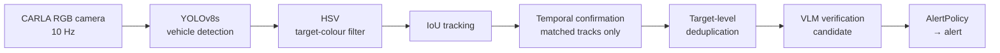
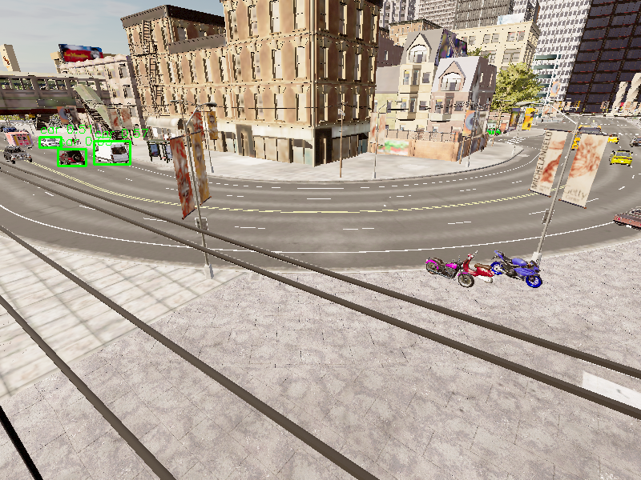
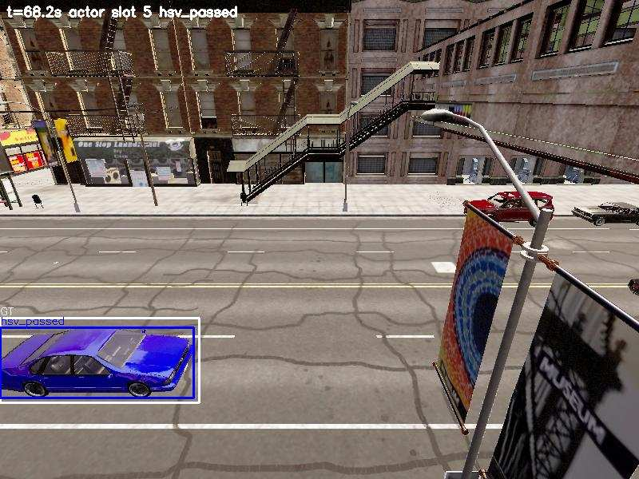
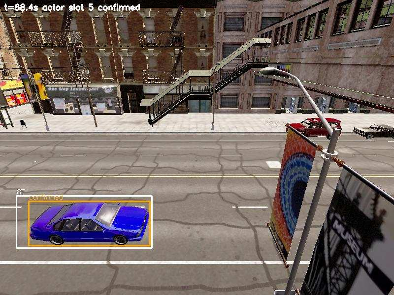
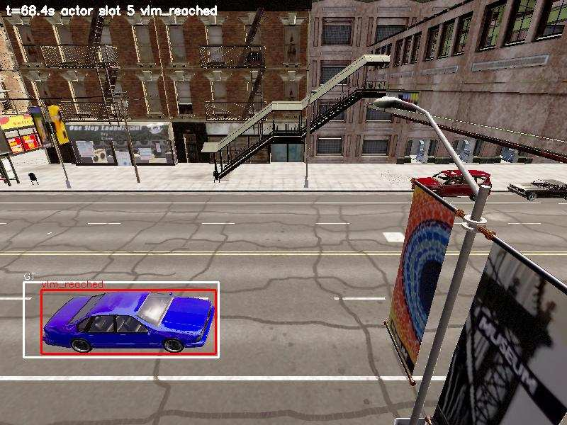
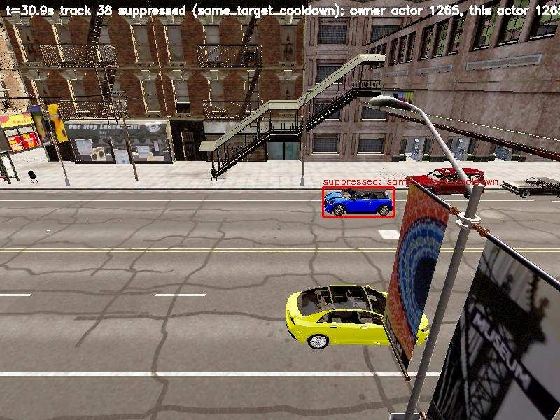
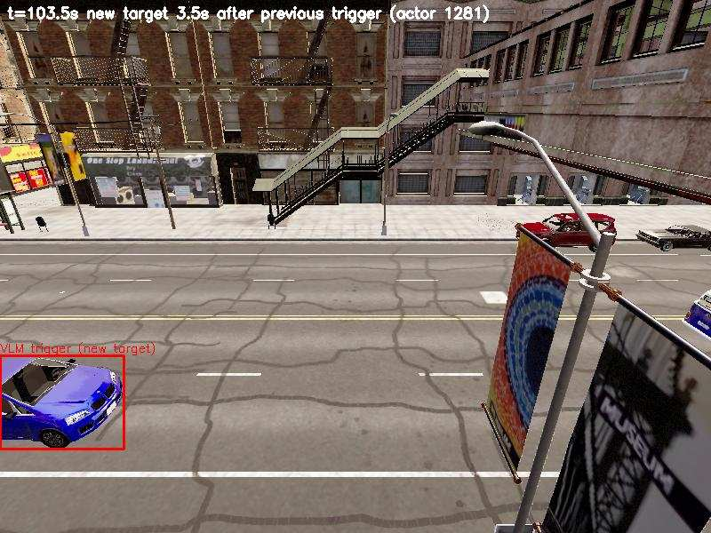

# UROPCLAW

CARLA 차량 감시 영상에서 지정된 색상의 차량을 찾아 알리는 AI perception pipeline입니다.
YOLO → HSV → Tracking → Temporal Confirmation → Deduplication → VLM 순서로 후보를 단계적으로 줄입니다.

## 1. Project Overview

**문제:** 감시 카메라의 모든 frame을 VLM(vision-language model)에 보내 "목표 차량인가"를 묻는 방식은 정확하지만, frame 수만큼 VLM 요청이 발생해 처리 부하와 비용이 커집니다.

**접근:** 빠르고 저렴한 단계(차량 검출, 색상 필터, 추적, 시간적 확인, 중복 억제)가 먼저 후보를 선별하고, 남은 후보만 VLM이 검증하도록 단계별 후보 선별 구조를 설계했습니다. 각 단계는 서로 다른 종류의 불필요한 요청을 걸러냅니다.

이 저장소에는 연구 당시 구현과, 연구 종료 후 실제 CARLA 환경에서 수행한 **post-project validation**이 함께 있습니다. 두 결과는 아래에서 분리해 설명합니다.

## Key Results (post-project validation)

10분 연속 CARLA 감시, 6,000 frames/run, 독립 실행 3회. 네 가지 구성이 동일한 frame과 동일한 YOLO 출력을 공유합니다.

| | Run 1 / Run 2 / Run 3 |
|---|---|
| Target coverage (Full pipeline) | **9/9, 9/9, 9/9** target 차량이 VLM 단계까지 도달 |
| HSV 제거 시 VLM trigger | Full 대비 **6.74–7.47배** |
| Temporal 제거 시 dedup 직전 후보 | Full 대비 **3.22–3.28배** |
| Dedup 제거 시 VLM trigger | Full 대비 **4.68–5.48배** |
| Stale-track VLM trigger (수정 후) | **0 / 0 / 0** |
| Dropped frames / crashes | **0 / 0** |

VLM 요청 감소와 target coverage를 함께 검증했습니다. 여기서 "VLM trigger"는 production logic이 VLM을 호출하는 시점을 센 값이며, 이 실험에서 실제 VLM 추론은 수행하지 않았습니다.

## 2. Architecture



| 단계 | 역할 |
|---|---|
| YOLOv8s | frame에서 차량(car, bus, truck, motorcycle) bounding box를 검출합니다. |
| HSV colour filter | box 중앙 영역의 HSV 분포로 색을 분류하고, 미션 대상 색(예: blue)과 다른 차량을 후보에서 제외합니다. |
| IoU tracking | frame 간 box를 IoU로 연결해 track ID를 유지합니다. |
| Temporal confirmation | 이번 frame에서 실제로 매칭된 track의 3-frame 다수결 색상이 대상 색일 때만 후보로 승격해, 순간적인 오검출을 거릅니다. |
| Deduplication | target(track) 단위 30초 cooldown과 track 분할 연속성 판단으로, 같은 차량의 반복 VLM 요청을 억제합니다. 다른 차량은 막지 않습니다. |
| VLM | 남은 후보 crop을 검증합니다. production에서는 `claude --print` CLI를 호출하며, 실패 시 fail-open으로 동작합니다. |
| AlertPolicy | 미션 조건과 VLM 결과를 확인한 뒤 detection event를 기록하고 경보를 보냅니다. |

- CARLA actor ID는 **validation ground truth로만** 사용하며, production 판단에는 쓰지 않습니다.
- 코드 기준 상세 구조: [pipeline_architecture.md](validation/pipeline_architecture.md)

## 3. Historical Research vs Post-project Validation

### Historical Research

- CARLA 기반 차량 감시, YOLO / HSV / Tracking / VLM pipeline, 4개 Discord agent 구조로 구현했습니다.
- 발표: 한국자동차공학회 2026 춘계학술대회, 「멀티 AI Agent 커뮤니티 기반 차량 환경 정보 공유 및 상황 인지 시스템」
- 연구 당시 코드: tag [`research-baseline`](https://github.com/jsy202/UROPCLAW/tree/research-baseline). 당시 README 원문: [docs/original_research_readme.md](docs/original_research_readme.md)
- 연구 당시 기록된 수치(46,372 / 28,736 / 3,298 / 53)는 측정 단위와 조건을 현재 validation 기준으로 확인할 수 없습니다. 그래서 headline 성과로 쓰지 않고, 아래 validation 결과와도 비교하지 않습니다.

### Post-project Validation

연구 종료 후 별도로 수행한 검증입니다. 모든 수치는 이 저장소에 커밋된 실행 결과 파일에서 나왔습니다.

- **Experiment A**: 동적 다차량 system integration / stability validation
- **Experiment B v2**: 10분 연속 감시 4-way ablation (핵심 결과)
- 검증 중 발견해 수정한 production 결함 2건
- 이보다 앞서 합성 입력 replay로 수행한 failure-handling 검증 (아래 "Earlier replay-based validation")

전체 문서 목록: [validation/carla_e2e/README.md](validation/carla_e2e/README.md)

## 4. Experiment A: Dynamic Multi-Vehicle System Validation

**질문:** 실제 CARLA 동적 다차량 환경에서 production pipeline이 end-to-end로 정상 동작하는가?

이 실험의 목적은 성능 감소율 측정이 아니라 system integration과 안정성 검증입니다.

**조건**
- CARLA 0.9.13 Town10HD_Opt, synchronous 0.1 s tick, Real YOLOv8s on RTX 3060
- 제어 차량 16대(background 15 + probe 1), fixed camera 800×600 FOV 90
- Target(파란 probe) / Non-target(같은 장면에서 probe 색만 빨강) 각 10회
- Fake VLM / Fake Alert 사용

**결과**

| | Target | Non-target |
|---|---|---|
| Success | 10/10 | 10/10 |
| Target event / false target event | 10 / 0 | 0 / 0 |

- 매 run에서 background 15/15대가 실제로 이동했고, 한 frame 최대 YOLO 차량 검출은 4개였습니다.
- dropped frame 0, crash 0, 매 run actor 17/17 정리.
- 실행 과정에서 validation harness 결함 9건을 재현하고 수정했습니다. 예: Traffic Manager lifecycle에서 발생한 native abort(exit 134), synchronous sensor frame skip, 구조물 내부에 배치된 카메라.
- 상세: [validation report](validation/carla_e2e/multivehicle/validation_report.md) · [defects](validation/carla_e2e/multivehicle/evidence/defects/DEF-MV-01-09.md)

## 5. Experiment B v2: 10-Minute Continuous Monitoring Ablation

**질문:** 동일한 10분 동적 traffic에서 HSV, Temporal Confirmation, Deduplication은 VLM workload에 각각 어떤 영향을 주는가?

**조건**
- 600 s, 10 Hz, 6,000 input frames/run, 독립 실행 3회
- TM autopilot 차량 70대, 8색 palette(파랑 9대)
- Real YOLOv8s를 frame당 한 번만 실행하고, 같은 frame·YOLO 출력·HSV 결과를 네 branch에 동일하게 전달
- branch마다 tracker / temporal / dedup state를 독립 instance로 운용
- 실제 VLM은 호출하지 않고 VLM trigger만 집계

**VLM triggers**

| Configuration | Run 1 | Run 2 | Run 3 | Interpretation |
|---|---:|---:|---:|---|
| Full | 19 | 23 | 23 | 최종 production pipeline |
| No HSV | 142 | 156 | 155 | Full 대비 6.74–7.47배 |
| No Temporal | 22 | 29 | 29 | Full 대비 1.16–1.26배 |
| No Dedup | 89 | 126 | 126 | Full 대비 4.68–5.48배 |

**Dedup 직전 후보 수**

| Configuration | Run 1 | Run 2 | Run 3 | Full 대비 |
|---|---:|---:|---:|---:|
| Full | 89 | 126 | 126 | 1.00x |
| No Temporal | 292 | 407 | 406 | 3.22–3.28x |

**각 단계의 역할** (동일 traffic에 대한 ablation comparison이며, 인과 효과로 단정하지 않습니다)
- **HSV:** 비대상 색 차량을 VLM 후보에서 제거하는 주된 필터링 단계입니다.
- **Temporal:** 순간 검출이나 불안정한 후보가 dedup에 도달하기 전에 줄입니다(후보 3.22–3.28배 감소). 최종 trigger 차이(1.16–1.26배)가 작은 이유는, 남은 반복 요청을 dedup이 다시 억제하기 때문입니다.
- **Dedup:** 같은 target의 반복 VLM 요청을 억제합니다.

6,000 frame과 19–23 trigger 사이의 차이를 하나의 "필터링 효과"로 묶지 않았습니다. 각 단계는 서로 다른 종류의 요청을 줄입니다.

**Target coverage (Full pipeline)**

| Stage | Run 1 | Run 2 | Run 3 |
|---|---:|---:|---:|
| Entered FOV | 9 | 9 | 9 |
| YOLO detected | 9 | 9 | 9 |
| HSV passed | 9 | 9 | 9 |
| Tracked | 9 | 9 | 9 |
| Confirmed | 9 | 9 | 9 |
| VLM reached | 9 | 9 | 9 |

- 다른 target의 cooldown 때문에 차단된 target: 0
- stale-track confirmation 후보 0, stale-track VLM trigger 0
- 모든 trigger bbox가 해당 frame의 실제 detection이었습니다.
- 상세: [validation report](validation/carla_e2e/continuous_ablation_v2/validation_report.md) · [before/after](validation/carla_e2e/continuous_ablation_v2/before_after_summary.csv) · [target funnel](validation/carla_e2e/continuous_ablation_v2/target_actor_funnel.csv)

## 6. Production Defects Found and Fixed

Experiment B v1 결과를 분석하다가 production logic의 결함 2건을 발견했습니다. 수정은 [`a25c6ae`](https://github.com/jsy202/UROPCLAW/commit/a25c6ae)에 있으며, 회귀 테스트([tests/unit/test_dedup_and_stale_tracks.py](tests/unit/test_dedup_and_stale_tracks.py))는 수정 전 코드에서 실패하고 수정 후 통과합니다.

### Stale Track Confirmation

- **문제:** `YoloWorker`가 이번 frame에서 매칭되지 않은(disappeared) track까지 `TemporalConfirm.update`에 넣고 있었습니다.
- **영향:** 사라진 track이 마지막 색으로 계속 투표해 confirmation을 통과했고, 과거 bbox로 현재 frame을 crop해 빈 도로 이미지가 VLM 후보가 될 수 있었습니다. v1 Run 3 기준 Full 후보 88/215개, trigger 4/11개가 stale track에서 나왔습니다.
- **수정:** `disappeared == 0`인, 이번 frame에서 매칭된 track만 temporal evidence를 갱신합니다. 그 결과 후보 bbox는 항상 현재 frame의 detection bbox입니다.
- **결과:** stale 후보 0, stale trigger 0. Full trigger crop 65장 모두에 실제 차량이 있습니다.

### Global Dedup Cooldown

- **문제:** camera agent 하나에 30초 cooldown 하나만 적용돼, 서로 다른 target도 30초 안에 나타나면 차단됐습니다. v1에서는 target 차량 9대 중 5–6대만 VLM에 도달했습니다.
- **수정:** target(track) 단위 30초 cooldown으로 바꿨습니다. 새 track은 다음 조건을 모두 만족할 때만 같은 차량의 분할 track으로 보고 억제합니다.
  - confirmed 색이 같음
  - 해당 target의 마지막 후보로부터 2.0초 이내 (tracker의 기존 reconnect window 값)
  - 중심이 box 대각선 길이 이내
- production에서 실제로 얻을 수 있는 정보(camera, track, 색, bbox, 시간)만 사용하고, CARLA actor ID는 쓰지 않습니다.
- **결과:** target coverage가 5–6/9에서 9/9로 개선됐고, 다른 차량의 cooldown 때문에 차단된 target은 0입니다.

수정 전(v1)과 수정 후(v2)는 서로 다른 실행이며 traffic이 bit 단위로 같지 않습니다. 그래서 절대값 비교보다 각 run 안의 branch 비교를 우선했습니다.

## 7. Evidence

| | |
|---|---|
| <br/>Experiment A: 동적 traffic, 한 frame 최대 4대 검출 | <br/>Experiment B v2: target 차량 HSV blue 통과 |
| <br/>Temporal confirmation (흰 box = CARLA ground truth) | <br/>VLM trigger (현재 frame의 detection bbox) |
| <br/>같은 target의 반복 요청 억제 | <br/>다른 target이 직전 trigger 3.5초 뒤 VLM에 정상 도달 (이전 정책에서는 차단) |

Stale track 수정 전/후: [수정 전 빈 도로 crop](validation/carla_e2e/continuous_ablation_v2/evidence/before_after/before_v1_run2_full_stale_trigger_f1300_t77.jpg) · [수정 후 전체 Full trigger crop](validation/carla_e2e/continuous_ablation_v2/evidence/before_after/after_v2_all_full_trigger_crops.jpg)

## 8. Remaining Limitations

- **실험 범위:** map 1개, camera pose 1개, traffic 구성 1개 중심이며, 다른 map·날씨·조명·카메라 조건으로 일반화할 수 없습니다.
- **재현성:** 3회 실행은 서로 bit 단위로 같지 않습니다. 렌더링/추론 차이와 Traffic Manager 차이 때문이며, 3회로는 신뢰구간을 낼 수 없습니다.
- **VLM:** Experiment B는 VLM trigger만 집계했고 실제 VLM을 호출하지 않았습니다. Real VLM의 정확도와 지연은 측정하지 않았습니다.
- **Track fragmentation:** 차량이 거리 배너 뒤를 지나며 track이 끊기면, 같은 차량이 다시 trigger되는 경우가 run당 4–5건 남았습니다. 완전히 해결하려면 appearance-based Re-ID가 필요하지만, 이번 범위를 넘어 limitation으로 관리했습니다. 연속성 규칙의 threshold는 결과를 보고 조정하지 않았습니다.
- **재방문:** Re-ID가 없기 때문에 30초 이후 다시 나타난 같은 차량은 새 요청이 됩니다(run별 4–9건).
- **Ground truth 라벨:** `vehicle.micro.microlino`는 지정한 색과 무관하게 몸체가 파랗게 렌더링되어, ground truth 상 non-target으로 분류된 차량이 실제로는 파란색이었습니다(crop으로 확인).
- **Latency:** synchronous CARLA에서 측정한 처리 시간은 실제 도로 환경의 실시간 latency가 아닙니다.
- **YOLO weight:** 원래 연구 weight를 쓸 수 없어, 새로 받은 pretrained YOLOv8s를 사용했습니다.

상세: [Experiment B v2 limitations](validation/carla_e2e/continuous_ablation_v2/limitations.md) · [Experiment A limitations](validation/carla_e2e/multivehicle/limitations.md)

## Earlier replay-based validation

CARLA 실험에 앞서, 합성 입력 replay와 Fake detector / VLM / Alert로 pipeline의 데이터 전달과 장애 처리를 검증했습니다. 이 과정에서 지표 결함 6건(U01–U06)을 테스트로 재현하고 수정했습니다. 예를 들어 VLM timeout과 오류가 지표에 나타나지 않던 문제, 평가 baseline에 dedup이 잘못 적용되던 문제입니다. 이 결과는 합성 조건의 결과이며 실제 운영 수치가 아닙니다.
[test report](validation/test_report.md) · [benchmark](validation/benchmark.md) · [limitations](validation/limitations.md)

## Tests

```bash
pip install -r requirements-test.txt
python3 -m pytest          # 119 passed, 1 skipped (CARLA·GPU·VLM·Discord 불필요)
```

skip된 1건은 수정 전 production logic을 재현하던 v1 shadow branch의 과거 equivalence test로, 사유를 테스트 안에 명시했습니다. CARLA host 실행 방법은 [validation/carla_e2e/README.md](validation/carla_e2e/README.md)에 있습니다.

## What I Validated

- CARLA 동적 다차량 감시 환경에서 YOLO → HSV → Tracking → Temporal → Dedup pipeline을 end-to-end로 검증했습니다(Target 10/10, Non-target 10/10).
- 10분 연속 6,000-frame 실험에서 동일 입력 4-way ablation을 설계했습니다. HSV 제거 시 VLM trigger가 6.74–7.47배, Dedup 제거 시 4.68–5.48배, Temporal 제거 시 dedup 직전 후보가 3.22–3.28배 늘어남을 측정했습니다.
- 검증 과정에서 stale track confirmation과 global dedup cooldown 결함을 발견해 production 코드를 수정했고, 수정 후 3회 모두에서 target coverage 9/9와 stale trigger 0을 확인했습니다.
- 남은 한계(track fragmentation, Re-ID 부재, 단일 scene)는 숨기지 않고 수치와 함께 기록했습니다.

## License

연구/교육 목적으로 제작했습니다. CARLA는 [CARLA 라이선스](https://carla.org/), YOLOv8은 [AGPL-3.0](https://github.com/ultralytics/ultralytics)을 따릅니다.
